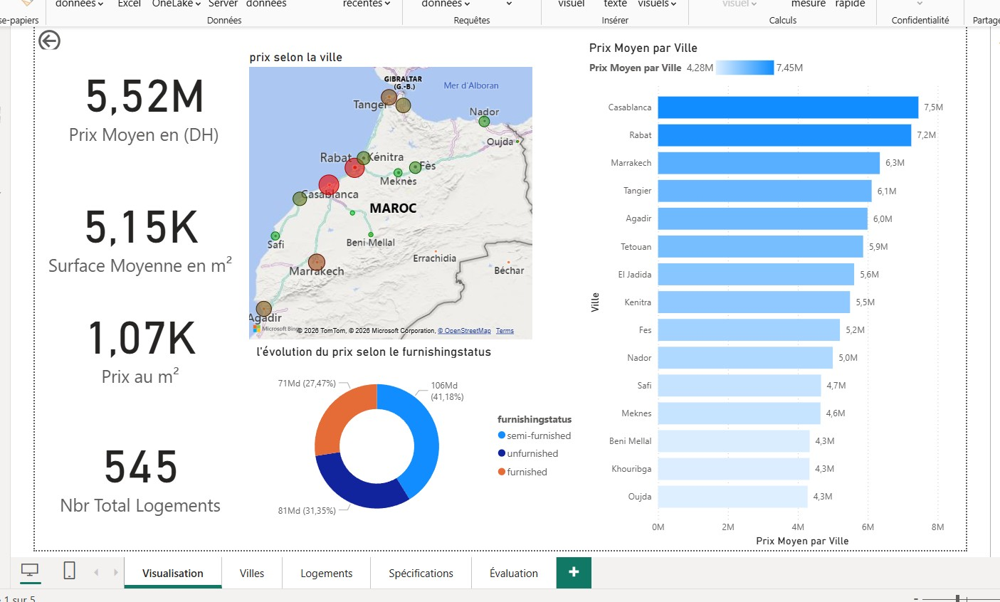
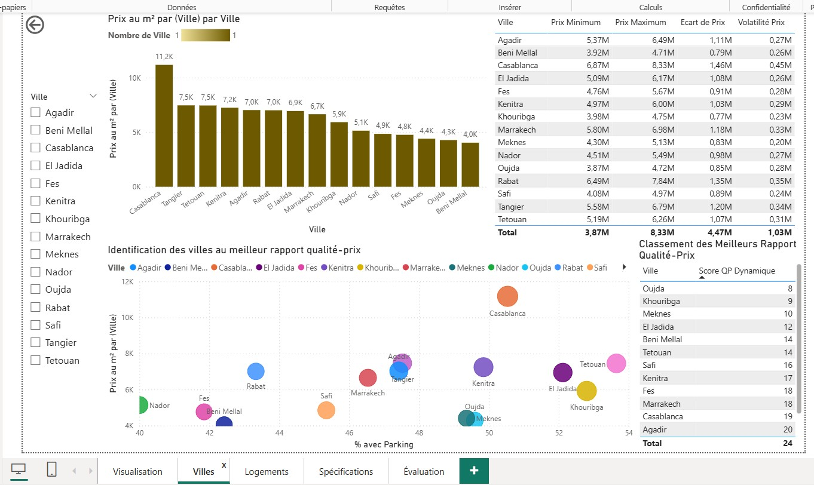
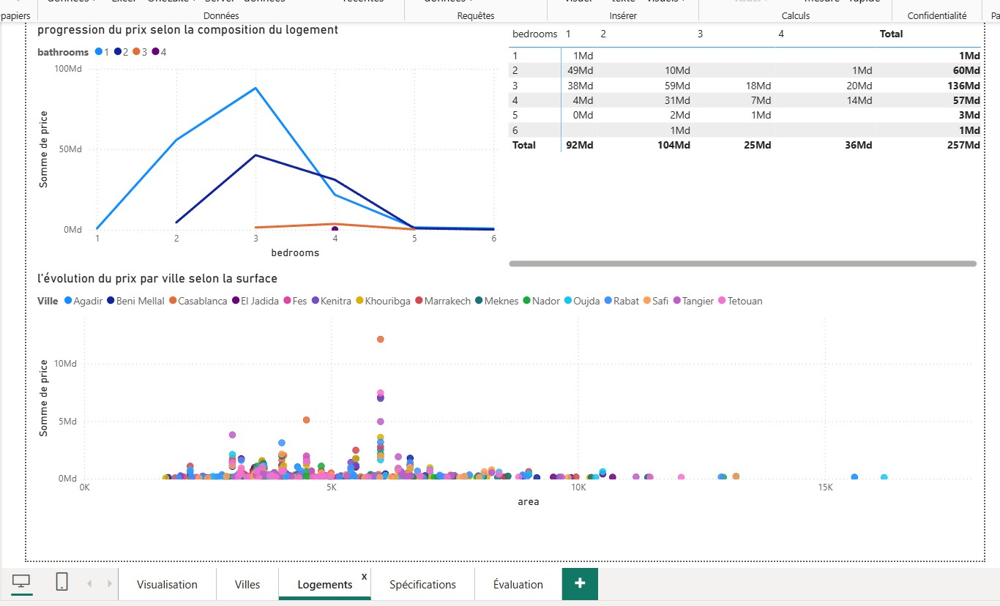
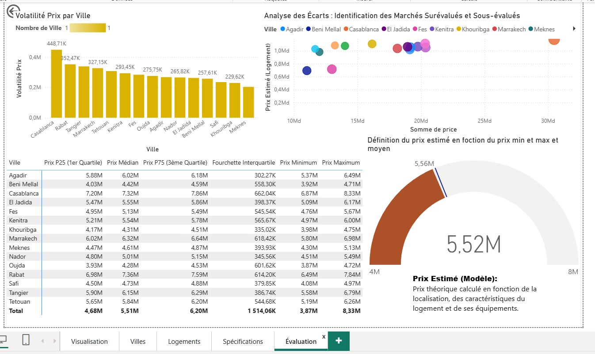
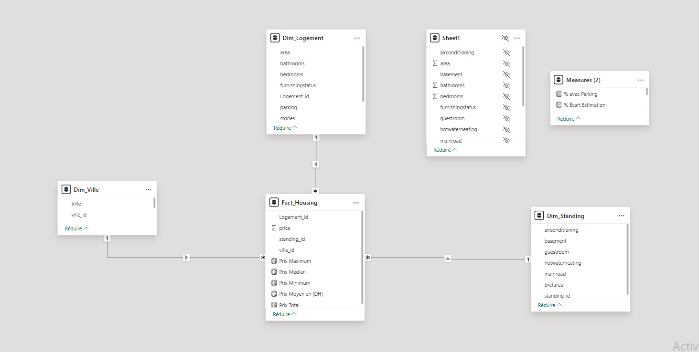
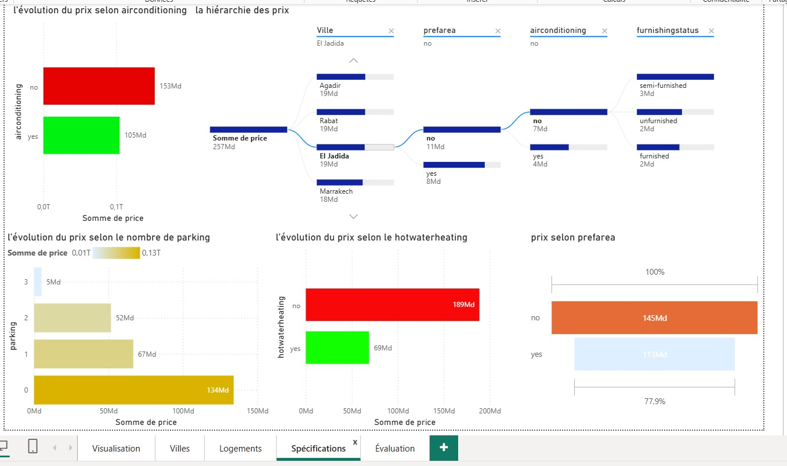

# Analyse Immobilière & Prévision des Prix - Power BI

Ce projet est un tableau de bord interactif développé sous Power BI pour analyser le marché immobilier au Maroc. Il permet de visualiser les tendances, d'évaluer les prix et d'identifier les opportunités d'investissement.

## 🎯 Objectifs du projet
- Analyser la répartition géographique des prix de l'immobilier.
- Identifier les facteurs influençant les prix (surface, équipements, standing).
- Détecter les marchés surévalués et sous-évalués.
- Fournir une estimation théorique des prix.

##  Outils et Méthodologie
- **Outil :** Microsoft Power BI Desktop
- **Modélisation :** Schéma en étoile (Star Schema) avec tables de faits et dimensions.
- **Langage :** DAX pour les mesures calculées (Prix moyen, Volatilité, Écart d'estimation).
- **Source de données :** Fichier Excel (`Housing_BI_Morocco_REAL_PRICE.xlsx`).

##  Aperçu du Tableau de Bord

### 1. Vue d'ensemble (Visualisation Globale)

*KPI globaux, carte interactive du Maroc et analyse des prix par ville.*

### 2. Analyse par Ville (Statistiques Villes)

*Identification des villes offrant le meilleur rapport qualité-prix et volatilité des prix.*

### 3. Analyse des Logements (Statistiques Logement)

*Impact du nombre de chambres, de la climatisation, du chauffage et du parking sur le prix final.*

### 4. Évaluation et Détection des Écarts

*Analyse des quartiles, détection des marchés sous-évalués et calcul du prix estimé théorique.*

### 5. Modèle de Données

*Architecture du modèle en étoile utilisée pour optimiser les performances et la clarté des analyses.*

### 6. Spécifications du Projet

*Détails des spécifications techniques et fonctionnelles du tableau de bord.*

##  Fichiers du projet
- `ProjetBI.pbix` : Le fichier source Power BI (nécessite Power BI Desktop pour être ouvert).
- `Housing_BI_Morocco_REAL_PRICE.xlsx` : Le jeu de données source (546 lignes).
- `Questions BI.txt` : Les questions business auxquelles le tableau de bord répond.
